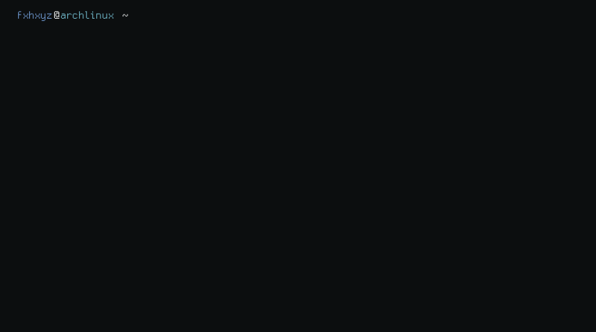

<picture>
    <source media="(prefers-color-scheme: dark)" srcset="./output.gif">
    <source media="(prefers-color-scheme: light)" srcset="./output.gif">
    
</picture>

<i>Generated automatically using [x0rzavi/github-readme-terminal](https://github.com/x0rzavi/github-readme-terminal) on Mon Feb 17 09:39:16 PM EET 2025</i>

